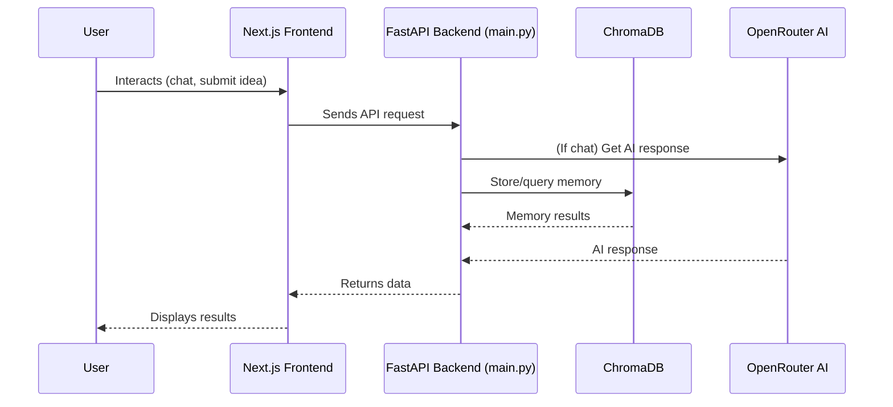

# Nava AI

<p align="center">
  
  
  <a href="#quickstart"></a>
</p>

<p align="center">
  <b>Meet Nava AI — Your AI Co-Founder</b><br>
  <i>Score your startup ideas. Store your second brain. Get weekly insights. Build faster, smarter, better — with Nava.</i>
</p>

<p align="center">
  
</p>

---

Table of Contents

- Overview
- Features
- Architecture
- Quickstart
- API Endpoints
- Dependencies
- Contributing
- License
- Acknowledgements

---

🚀 Overview  
Nava AI helps founders ideate, validate, and organize startup ideas using advanced AI and persistent memory. Get actionable insights and manage your knowledge with ease.

---

✨ Features  
- AI Chat & Scoring: Brainstorm and evaluate ideas with top-tier AI.
- Persistent Memory: Store, search, and manage your knowledge base.
- API-Driven: Add, query, and wipe memories programmatically.
- Modern UI: Responsive Next.js frontend with waitlist support.

---

🏗️ Architecture



---

⚡ Quickstart

🐳 One-Command Docker Compose

```bash
docker compose up --build
```
- Backend: http://localhost:8000
- Frontend: http://localhost:3000

🛠️ Local Dev

1. Clone the Repository
    ```bash
    git clone https://github.com/Ak2556/nava-ai
    cd nava-ai
    ```

2. Backend Setup
    ```bash
    cd backend
    pip install -r requirements.txt
    cp .env.example .env  # Add your OpenRouter API key
    uvicorn main:app --reload
    ```

3. Frontend Setup
    ```bash
    cd frontend-nava-ai
    npm install
    npm run dev
    ```

---

🧠 API Endpoints

`POST /openrouter` — Generate AI Reply & Store in Memory

Request:
```bash
curl -X POST http://localhost:8000/openrouter \
  -H "Content-Type: application/json" \
  -d '{"prompt": "How do I validate a SaaS idea?"}'
```

Sample Response:
```json
{
  "response": "To validate a SaaS idea, start by...",
  "model": "openai/gpt-4o-mini",
  "request_id": "123e4567-e89b-12d3-a456-426614174000"
}
```

---

`POST /search-memory` — Search Stored Memories

Request:
```bash
curl -X POST http://localhost:8000/search-memory \
  -H "Content-Type: application/json" \
  -d '{"query": "SaaS validation", "n_results": 2}'
```

Sample Response:
```json
{
  "memories": [
    {
      "prompt": "How do I validate a SaaS idea?",
      "response": "To validate a SaaS idea, start by...",
      "prompt_metadata": { "model": "openai/gpt-4o-mini" },
      "response_metadata": { "model": "openai/gpt-4o-mini" },
      "prompt_id": "abc123",
      "response_id": "def456"
    }
  ]
}
```

---

`DELETE /memory/clear` — Wipe All Stored Memories

Request:
```bash
curl -X DELETE http://localhost:8000/memory/clear
```

Sample Response:
```json
{ "message": "All memory cleared." }
```

---

`POST /chroma/add` — Add Memory

Request:
```bash
curl -X POST http://localhost:8000/chroma/add \
  -H "Content-Type: application/json" \
  -d '{"id": "unique-id", "content": "My startup idea", "metadata": {"tag": "SaaS"}}'
```

Sample Response:
```json
{ "status": "success", "message": "Memory added" }
```

---

`POST /chroma/query` — Query Memory

Request:
```bash
curl -X POST http://localhost:8000/chroma/query \
  -H "Content-Type: application/json" \
  -d '{"query": "startup", "top_k": 2}'
```

Sample Response:
```json
{
  "results": {
    "documents": [["My startup idea"]],
    "ids": [["unique-id"]],
    "metadatas": [[{"tag": "SaaS"}]]
  }
}
```

---

`POST /chroma/wipe` — Wipe All Memories

Request:
```bash
curl -X POST http://localhost:8000/chroma/wipe
```

Sample Response:
```json
{ "status": "success", "message": "Memory wiped" }
```

---

🛠️ Dependencies

- Python 3.9+
- FastAPI, Uvicorn
- ChromaDB
- OpenRouter API
- Next.js, React, Tailwind CSS

See `requirements.txt` for full backend dependencies.

---

🌱 Contributing

1. Fork the repo and create your branch.
2. Make your changes and add tests if needed.
3. Submit a pull request with a clear description.

---

📄 License

MIT License

---

🙌 Acknowledgements

- [ChromaDB](https://www.trychroma.com/)
- [OpenRouter](https://openrouter.ai/)
- [FastAPI](https://fastapi.tiangolo.com/)
- [Next.js](https://nextjs.org/)

---

<p align="center"><i>Made with ❤️ by the Nava AI team</i></p>
